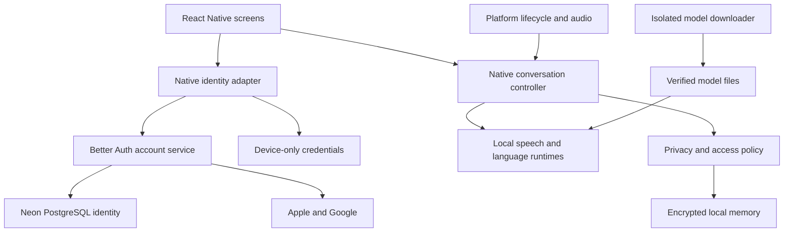

# Eilo Architecture

## Current merged baseline 5 October 2026

CR-2026-10-05-01 was authorized by the owner: finalize the ripple/results design and merge it into the project. Eilo Visual Interaction Design v2.0 is authoritative for updated visual/search/outside-app behavior; the following historical material does not override it. Core inference and all conversation history/derived memory remain local. Optional confirmed live search is a new external query flow, not cloud conversation inference. No app code, provider provisioning, device pass or deployment is implied.

- Home now uses a blue/light-purple theme and rounded centre-out ripples during listening/speaking; stopped/standby/thinking remain truthful and distinct. Accessible Start/Stop, Memory and Settings remain available.
- Spoken response text is the default fallback; rich cards show enabled text/images/videos with attribution and explicit media playback. Recommended initial defaults: text on, images/video off.
- Visual cards expire after20 seconds of actual inactivity after speech/processing/loading/video/interaction; pin and dismiss are explicit. The existing60-second conversation timer remains independent. Lock/Stop/privacy transitions clear personal display state.
- Android outside-app overlay requires separate opt-in, special permission and physical-device feasibility. iOS has a generic notification fallback; rich results may require opening Eilo. No generic cross-platform Siri overlay or guaranteed notification timeout. Locked surfaces remain generic.
- Search off by default, per-query preview/confirmation and minimized approved payload only; no transcript/memory/account ID/location history upload, no query/results in Neon or service logs. Provider/media licensing, retention, cost and real-device cache inspection block release until resolved.
- GitHub selected public initially/private later. Actions, EAS, Vercel and native test distribution remain the recommended stack subject to integration gates. Human task review, staging authorization and production/store approval remain separate.
- JSON backlog1.5 contains175 tasks across23 groups, including26 additions; design approval does not authorize their implementation. The2October UX approval is reconciled in JSON and CSV; old pending wording is historical.

## Historical baseline through 2 October 2026

Current revision:2October2026 · Neon account database and authentication direction authorized; detailed implementation design awaiting review. Historical phase/approval statements below do not describe current completion.

Current architecture revision1.2 ·2October2026 · native direction approved; Neon account design ready for review

This design implements the approved Eilo MVP Specification v1.0: Android and iOS, English, optional email/social sign-in and guest use, local conversational inference, encrypted local history, 90-day default retention, a 250 MB personal-memory limit, and generic locked-screen conversation. It completes workflow stage 4, architecture. The owner approved proceeding to stage 5 implementation planning on 1 October 2026. Stage 6 development remains unapproved. No application code, dependency installation, device benchmark, or security test has been performed.

The recommended design is a React Native interface over a native voice engine, with separate platform audio/lifecycle adapters, a shared local inference core, and an encrypted memory service. A Better Auth account service backed by Neon PostgreSQL is proposed; there is minimal Neon account database or conversation server. Background support on both platforms remains a feasibility gate, especially CPU inference under iOS background restrictions.

## 1 System design

### Component relationships

The downloader and optional identity adapter have separate network paths; conversation components do not. This is a dependency boundary and audit requirement, not an assertion that a shared mobile process has a separate OS network permission per component. Verify actual traffic and library behaviour.

| Component | Responsibility | Persistent personal data |
|---|---|---|
| Native identity adapter | Optional provider identity and lifecycle, separate from Memory | Minimal secure device-only subject/tokens |
| Better Auth account service | Provider token validation/exchange/revocation | Minimal identity/session data; no conversation history |
| React Native with TypeScript | Home, Memory, Settings, onboarding, accessibility; send commands and show native state | None in JavaScript storage |
| Native controller | Own state, cancellation, wake activation, turn handling, retention/write policy and privacy transitions | Writes only through memory service |
| Android adapter in Kotlin | Microphone foreground service, audio capture/output, audio focus, keyguard, calls/routes and notification Stop | Protected keys/settings only |
| iOS adapter in Swift | AVAudioSession/voice processing, permitted background audio, lock/protected-data changes, interruptions and routes | Protected keys/settings only |
| Shared native inference | Wake spotting, recognition, reply generation, speech generation | Generic model files only |
| Native memory service | Encrypted history, derived facts, retrieval, deletion, retention and quota | Authorized local history only |
| Native model manager | Manifest, file verification, downloads, atomic update/rollback | Generic model files and version metadata |

React Native’s official documentation supports sharing C++ native module logic across Android and iOS. [A1] However audio callbacks, services, protected storage and lifecycle handling remain platform-specific.

### Framework decision

Recommend React Native with the New Architecture, Codegen/TurboModule integration and native build access. Use native projects rather than a JavaScript-only runtime or Expo Go. Expo with custom development builds could be assessed later; it is not a requirement. Pin a supported stable React Native release and native dependency revisions when implementation planning is approved; do not adopt unpinned latest dependencies.

The native engine must run without a live React Native screen or active JavaScript event loop. The UI is a client of native state, not the owner of background work. A headless JavaScript task is not the mechanism for keeping audio alive. No local HTTP inference server, WebView inference or Python runtime is introduced. Account APIs are separate from conversation inference.

## 2 Local model and runtime decisions

### Initial evaluation stack

The owner approved these as evaluation candidates, not final production selections or measured phone results.

| Function | First candidate | Runtime direction | Alternative or failure condition |
|---|---|---|---|
| Wake phrase | English keyword spotter compatible with sherpa-onnx | Native ONNX runtime through sherpa-onnx | Exact checkpoint/license/phrase quality must pass review; do not replace with continuous ambient transcription |
| Turn detection | Native VAD plus streaming endpoint rules | Small local VAD, calibrated with echo processing | Candidate checkpoint remains to be selected; balance pauses against response delay |
| Recognition | Moonshine Small Streaming, English, 123M | Moonshine native mobile bindings | Test Medium for difficult speech and Tiny for lower resources; never silently degrade to cloud |
| Conversation | Qwen3-1.7B, quantized GGUF, non-thinking mode | llama.cpp in-process C++ | Qwen3-0.6B as a CPU/low-power comparison; reject if quality fails rather than assuming size alone is sufficient |
| Speech output | Installed offline English system voice | AVSpeechSynthesizer / Android TextToSpeech | Kokoro deferred; no network voice fallback |
| Persistent retrieval | SQLCipher-encrypted local text search and source-linked facts | Native storage/search | Vector embeddings deferred unless lexical retrieval demonstrably misses the approved recall tests |

Moonshine provides native iOS/Android paths. [A2] Qwen3 documents a non-thinking mode and local llama.cpp support; disable thinking through the actual chat-template configuration rather than asking the model politely in a prompt. [A3] llama.cpp supplies an in-process C/C++ inference base. [A4] Kokoro is compact, while sherpa-onnx supplies mobile speech and keyword-spotting facilities. These components still require checkpoint-by-checkpoint license and integration verification. [A5–A6]

Why a modular stack: explicit transcripts and reply boundaries simplify memory provenance, cancellation, interruption status and content policy. Keep an adapter interface so models can change without changing the UI. LFM2.5-Audio remains an integrated challenger, not an additional always-loaded model; reconsider it only if measured benefits outweigh runtime, licensing and memory-policy complexity.

### Reply pipeline

1. Standby runs only wake spotting, minimal VAD and the two-second rolling audio buffer. No ambient transcript, fact extraction or conversational prompt exists.
2. Wake activation transfers the relevant buffered suffix into ASR so a wake phrase immediately followed by a question is not lost. Bound transfers and avoid replaying the phrase as user content.
3. Streaming ASR works during the utterance; endpoint rules finalize the turn. Low-confidence input asks for clarification.
4. The controller checks current privacy mode and lock state. Only an authorized unlocked history session can retrieve eligible memory.
5. Build a bounded prompt from persona/safety rules, current conversation and selected memories. Keep retrieved text in an explicitly untrusted data section. No tools, file access or remote search is available to the model.
6. Stream reply tokens into short natural clauses for TTS. A native boundary checks each emitted clause against policy before audio begins; it is not sufficient to run checks only after the entire reply is spoken. Small local models and clause checks do not guarantee complete safety; human evaluation remains required.
7. Playback proceeds while microphone processing uses echo cancellation. A confirmed interruption invalidates the generation ID, cancels synthesis/output buffers and starts the new turn.
8. Store finalized recognized text and produced reply text, with interrupted status and the playback progress available from the output subsystem. Do not claim that playback progress proves the user heard it. Never promote interrupted or uncertain text into a confirmed personal fact automatically.

Initial inference configuration: 4,096-token working context, at most 512 tokens of retrieved memory, and normally at most 256 generated tokens per turn. Larger requested responses can be handled in bounded continuation. These are architecture proposals to benchmark, not modifications to the retention policy. Quantization and sampling parameters must be tested for quality as well as speed.

Keep generic models warm while a user-enabled listening mode is active if budgets permit. Unload personal context on privacy transitions. Measure cold activation and warm turns separately; both still count toward the approved response targets. Preloading cannot be assumed to solve battery or memory limits.

## 3 Platform lifecycle and background audio

| Concern | Android design | iOS design |
|---|---|---|
| Start | User action while app visible; request microphone access and start declared microphone foreground service | User action establishes a permitted audio session after microphone access |
| Capture/playback | Native AudioRecord/output path, voice-processing effects where supported; validate routes | AVAudioSession play/record and native voice-processing audio I/O; validate configuration |
| Background | Service owns controller; ongoing operational notification with Stop | Native audio session owns controller within permitted background-audio use; no JS keepalive dependency |
| Screen off/locked | Keyguard state gates personal memory; ongoing capture is a tested service capability | Protected-data/lock events gate memory; ongoing capture/inference must remain permitted and tested |
| Inference backend | CPU baseline; acceleration only after validation | CPU baseline for background operation; optional Metal only while foreground and safe |
| Audio interruption | Pause/stop safely, release focus/capture as appropriate, expose actual state | Handle interruption/route events and permission loss; expose actual state |
| Process death/reboot | No automatic wake-service revival promise; user restarts through a permitted action | No wake availability after termination; user restarts |

Android explicitly documents background capture with a microphone foreground service and restrictions on creating it from background/boot. [A7] Doze/OEM restrictions and any required bounded wake locks need measurement; no blanket battery-optimization exemption is assumed.

iOS permits background recording under the appropriate audio configuration, but App Review requires intended background-mode use and capture disclosure. [A8–A9] Apple also restricts Metal command scheduling after backgrounding. [A10] Therefore foreground GPU results cannot validate this product’s screen-off experience. Drain/cancel foreground GPU work before switching to a tested CPU backend; if state transfer cannot be safe and fast, recreate an empty generic context and disclose any interrupted turn.

The iOS feasibility decision must assess the exact App Store use case and an actual audio/inference implementation. Documentation alone cannot establish acceptance of indefinite wake standby, permitted execution of every inference operation, or sustained latency. No silent playback trick, private API, fake VoIP call, or unjustified background entitlement is allowed.

### Controller states and privacy transitions

States: SETUP, STOPPED, STANDBY, CAPTURING, THINKING, SPEAKING, PAUSED and ERROR. Independently track device-lock state, history consent/private mode, background consent and authenticated memory-session status.

Each task carries a session ID, generation ID and policy epoch. Stop, lock, permission loss and critical mode changes invalidate the epoch before cancelling work. Audio output, memory reads and commits check the current epoch, so a late callback cannot speak a previously retrieved private fact or write a private-session transcript.

On device lock: cancel current playback and generation; invalidate the memory session; close encrypted history; release decrypted keys, selected memories, prompt/context and relevant runtime caches; enter generic standby if permitted. Newly supplied locked-screen utterances can be used within that new generic session, but prior stored memories cannot. On unlock, private history does not automatically become available: restore an authenticated memory session through the OS authentication flow. Optional email/social sign-in remains separate from device authentication.

Stop listening works through the UI, required native controls, and a wake-activated deterministic local command. Standby is not full ASR, so the documented command outside an active conversation is “Hey Eilo, stop listening.” Destructive actions never execute solely from a voice request; require the authenticated Memory/Settings screen.

## 4 Local data model and retrieval

All personal tables and indexes live inside the encrypted database; no plaintext search index, AsyncStorage history or analytics mirror exists.

| Entity | Main fields | Rules |
|---|---|---|
| Sessions | Random ID, local start/end, private flag, model version | Private sessions remain volatile, not rows |
| Messages | Random ID, session ID, role, text, creation/expiry, interruption/playback status | Ninety-day default; only finalized authorized text |
| Memory facts | ID, value, status, update/expiry, confidence/provenance | User-reviewable; distinguish explicit statements from uncertain inference |
| Memory sources | Fact ID and source message IDs | Delete/expire sources invalidates dependent facts/search results |
| Local settings | History/background consent, retention, voice/volume, schema version | No remote identity; sensitive changes require authentication |
| Model manifest | File/version/checksum, license reference, runtime compatibility | Generic metadata; no transcript-linked telemetry |

Initial retrieval uses encrypted text search plus explicitly confirmed preferences, returning a small set of relevant snippets. Do not run unconstrained background personality profiling. Summaries/facts are derived locally under the same history consent and retention rules; they never extend source lifetime. Fact extraction can happen after a turn when resources permit, but must not compete with the next reply or survive a privacy transition. Retrieval efficacy must pass the approved recall tests before claiming personalized continuity.

## 5 Security and encrypted storage

### Threat model

Protect against server/provider access to conversation content, ordinary local file extraction, backup/transfer leakage, unauthorized lock-screen disclosure, accidental logging, stale callback races and improper memory deletion. The design cannot guarantee privacy on a rooted/jailbroken or fully compromised running device, prevent a bystander hearing authorized playback, or guarantee forensic erasure from flash/OS memory.

### Unlocked history store

Use native SQLCipher with a random database key, protected by platform key facilities and a local authenticated memory session. SQLCipher encrypts database and journal/WAL page data; its documentation also requires disabling file-backed temporary stores. [A11] Configure memory-only temporary storage, safe checkpointing and storage cleanup; validate the exact native build and bindings. Do not treat installing a generic encrypted-storage package as sufficient.

iOS: choose a non-synchronizing, device-only, when-unlocked/passcode-protected key policy and OS authentication. Protect the main database with an appropriate complete-protection class. Android: wrap the database key with Android Keystore keys and require device authentication/unlocked state under a validated policy. Android documents historical issues with unlocked-device-required keys and fixes in Android 15; this influences the proposed test baseline. [A12–A13]

On lock, close the store and destroy owned decrypted key buffers; merely making a keychain key inaccessible does not revoke a key already copied into memory. Keys and history never enter JavaScript. Memory view results may cross into React Native only after authenticated access, are paginated, not persisted, and are cleared on privacy transitions.

### Writing new history while locked

The approved spec requires locked-screen generic replies and encrypted history writes without exposing earlier history. A database whose key is unavailable while locked cannot simply remain open to satisfy both requirements.

Propose a separate **sealed local inbox** for locked-screen turns:

1. Before enabling background mode, establish a device-local public/private encryption key pair. The protected private key is unavailable without the approved unlock/authentication policy; the public encryption key is available for writes.
2. For each finalized turn, use a vetted envelope-encryption implementation: a fresh authenticated-encryption key/nonce encrypts the record; a supported public-key scheme wraps that key. Store only ciphertext, wrapped key, algorithm/version and minimal random IDs/expiry metadata in an app-private, backup-excluded inbox. Use standard audited libraries/platform algorithms, not a new cryptographic protocol.
3. Erase owned plaintext/work keys after the bounded write. No earlier history or decrypted private key is available to the locked controller.
4. After authenticated unlock, decrypt eligible inbox records, validate them, import atomically into SQLCipher and remove envelopes. Deduplicate by random record ID so a crash between commit and cleanup does not duplicate messages.
5. Expired inbox records are excluded and removed using bounded expiry metadata even before import; metadata is local only and reveals limited timing/size. It does not include text or identities. Retention clocks and clock changes require tests.

Public-key sealing is a proposed composition requiring security review and native API verification. This is not a claim that the public key can authenticate the identity of a speaker or prevent a compromised app from adding false records. Bind format/version/record identifiers as authenticated metadata and verify the public key’s association with the protected private key.

Platform file protection must permit ciphertext writes and generic model reads during an already-running locked session without granting access to decrypt history. On iOS, this may require an appropriate after-first-unlock file class for generic assets and sealed ciphertext, while keeping history/private keys more restrictive. No listening before the first device unlock after boot is promised. If the selected policy cannot satisfy this composition, flag a blocker instead of weakening the approved privacy requirement.

### Retention, deletion and quota

Count history, facts/indexes, inbox and active storage journals against a 250,000,000-byte personal-store ceiling. Generic model files are excluded. Warn at a proposed 80% threshold and show actionable Memory controls. Reserve maintenance space within the cap; physical low-disk checks also apply.

Do not begin a history-enabled session/turn if a bounded write cannot be reserved safely. Offer authenticated cleanup or an explicitly selected private session; while locked and full, explain that unlocking is needed to manage storage. Do not silently switch to private mode or silently lose authorized text. During a turn, enforce a tested bounded write reservation and surface failure if an unforeseen storage error occurs.

Apply expiry before retrieval. Run cleanup at authorized startup/access and on available maintenance opportunities; OS scheduling cannot guarantee physical deletion at the exact expiry second while the app is terminated. If a stricter physical-deletion deadline is required, it is a spec clarification, not something this design can silently promise. Journal/compaction handling must not create plaintext or exceed the reserved cap.

Delete-source transactions remove messages, associated search entries and dependent facts/summaries. Delete-all cancels work, invalidates epochs, clears inbox/history, removes keys and creates fresh keys only after new consent/authentication. Key removal helps make encrypted copies inaccessible, but individual deletion does not prove forensic erasure. No cloud restoration path exists. Future adapters must be reset/rebuilt when source deletions affect them; training is absent from MVP.

### Backup, UI and network boundaries

Exclude database, inbox, journals, keys and future personal state from iCloud/app-managed sync, Android cloud backups and device transfer. Use device-only non-synchronizing credentials and verify actual backup/restore behaviour. Generic preferences may be restored only if consent/background mode defaults remain safe; never automatically resume listening after restore.

No transcript text in logging, crash SDKs, notifications, app-switcher snapshots or support bundles. Clear history views on lock; disable automatic screenshot exposure where the platform permits it, without claiming prevention of every screenshot.

The model downloader requests allowlisted HTTPS asset/manifest URLs. The separate identity adapter may contact approved provider/account-service endpoints with authentication payloads only. It accepts identifiers, not prompts or history; uses no stable user tracking ID; validates redirects/origins, signatures and content digests. Public distribution endpoints must not retain per-user connection history under the approved policy. Verify CDN/origin logs rather than assuming a no-account download is anonymous.

## 6 Native contracts

These are design contracts, not implemented API code.

| Operation | Input and result | Access rule |
|---|---|---|
| Start listening | Requested foreground/background mode; actual state or structured reason | Explicit action, permission, consent, model readiness and quota checks |
| Stop listening | No text payload; stopped acknowledgement | Always permitted; independent of UI/network |
| Read state | Native state, lock/privacy flags, model readiness | No transcript or private memory in state events |
| Open memory session | OS-authentication outcome; short-lived native authorization | Unlocked device; invalidate at lock/timeout |
| List/search memory | Bounded query/page; authorized text results | Valid authenticated memory session; expired/deleted data excluded |
| Correct/delete memory | IDs and explicit approved change | Authentication, provenance cascade and transaction |
| Set privacy/retention | Approved settings; acknowledged effective epoch | Authentication; never silently applied from model output |
| Install model pack | Trusted manifest ID; download/readiness state | Explicit setup/update action; no personal content |

Methods return bounded error codes such as PERMISSION_DENIED, MODEL_MISSING, MEMORY_LOCKED, STORAGE_FULL, AUDIO_INTERRUPTED and BACKGROUND_UNAVAILABLE. Do not include recognized speech or prompt contents in errors. Heavy work runs on native workers; no blocking work in audio callbacks or synchronous JavaScript calls. Audio queues and inference queues are bounded. The native state is authoritative when the UI reconnects.

## 7 Observability without collecting conversations

Production MVP has no analytics endpoint, remote traces, session replay or conversation logs. Keep a bounded, in-memory diagnostics view for non-content state/error codes and current resource indicators. Nothing persists into behavioral history or uploads automatically.

Performance evaluation later uses synthetic scripted audio and consented lab devices, with separate test-only measurements: end-of-speech to meaningful audio, stage timing, interruptions, memory, battery and heat. Synthetic fixtures may exist only in test assets; real-user content must not enter test logs. Require review before introducing any support export or remote metrics feature.

## 8 Proposed resource and compatibility budgets

| Item | Architecture proposal |
|---|---|
| Android evaluation baseline | ARM64, Android 15 or later, initially 8 GB RAM class; this is a trial baseline, not a final supported minimum |
| iOS evaluation baseline | iOS 18 or later; start with iPhone 15 Pro and a newer standard iPhone, plus the smallest-memory device proposed for support |
| Device coverage | At least Pixel and Samsung Android devices, multiple iPhone generations, speaker and headphone/Bluetooth routes |
| Model pack | Aim below 2 GB initial download; compute actual packaged sizes before approval, including tokenizers/voices/runtime assets |
| Application memory | Initial engineering budget: peak resident app memory below 2.5 GB on trial devices; lower OS process limits may force a stricter budget |
| Standby battery | Proposed ceiling: 2 percentage points per hour during controlled screen-off standby |
| Active battery | Proposed ceiling: 15 percentage points per hour in a defined screen-off conversation workload |
| Latency | Preserve approved median 1.5-second/p95 3-second meaningful reply and p95 300 ms interruption targets |

Battery results must include device health, temperature, networking, baseline idle consumption and workload definition. The budgets and evaluation scope above are approved planning targets, not measurements or promises. Run CPU-only background tests, not just foreground acceleration. Neither model parameter count nor nominal RAM certifies compatibility.

If budgets fail, compare the smaller model, quantization, context limits and scheduling while preserving quality and privacy. Do not silently lower quality, remove locked-screen support or change retention. Present the tradeoff for review. There is no per-minute cloud inference bill, but model distribution, maintenance, developer accounts and any future cloud training still cost money.

## 9 Decisions and feasibility gates

| Decision | Recommendation | Status |
|---|---|---|
| React Native role | UI and control integration; native engine owns conversation | Approved direction; validation pending |
| Model structure | Modular ASR/LLM/TTS with candidate stack above | Approved candidates; artifacts require benchmarks/license checks |
| History | SQLCipher plus source-aware local retrieval | Approved direction; build/key policy requires validation |
| Locked writes | Sealed ciphertext inbox with unlocked import | Approved direction; security/API composition review required |
| Background | Platform-native audio owners, CPU baseline on iOS | Platform feasibility unresolved |
| Backend | Public generic model distribution plus Better Auth account service backed by Neon PostgreSQL; minimal Neon account database | Proposed authentication amendment; owner review pending |
| Future training | No training or update contribution path in MVP | Matches approved scope |

Before finalizing the architecture for implementation planning, explicitly resolve or assign these gates:

1. Platform-compliant user-started standby and spoken replies outside UI/screen off on both platforms; iOS App Review rationale and CPU execution are the highest uncertainty.
2. CPU model quality, end-to-end latency, peak memory and sustained battery against the proposed supported devices. No results exist yet.
3. Locked-write encryption/key accessibility, callback races, authenticated retrieval, backups and deletion. A successful database encryption demo alone is insufficient.
4. Exact artifact and dependency licenses, reliable native builds, Kokoro phonemizer/voice packaging, wake-phrase quality and signed model distribution without retained user access logs.

Some gates require later development experiments. They cannot be completed by desk research. The architecture review must decide whether to authorize narrowly scoped feasibility experiments in the next plan; that authorization has not been assumed here.

## Architecture approval and planning gate

The owner approved the native-engine boundary, candidate model stack, SQLCipher/sealed-inbox direction, device evaluation scope and resource-budget proposals on 1 October 2026, and authorized preparation of the incremental implementation plan. The approved product specification remains unchanged.

Approval is of the design direction and validation scope, not a claim of proven security, performance, platform feasibility, or a final production model choice. Detailed encryption composition, backup handling, device support and iOS background behaviour retain their validation gates. Expired data is excluded at access; physical cleanup follows available maintenance opportunities as described above.

The next deliverable is the implementation and feasibility plan with a review/approval checkpoint after each small task. Application coding, package installation, experiments, training and deployment remain paused until the plan and an initial task are authorized. No implementation or device benchmark has occurred.

## Sources

Official technical sources reviewed on 1 October 2026. Publisher documentation supports available mechanisms, not measured performance of this combined app.

- A1 React Native shared C++ modules: https://reactnative.dev/docs/the-new-architecture/pure-cxx-modules
- A2 Moonshine native toolkit: https://github.com/moonshine-ai/moonshine
- A3 Qwen3 model and non-thinking mode: https://huggingface.co/Qwen/Qwen3-1.7B ; comparison https://huggingface.co/Qwen/Qwen3-0.6B
- A4 llama.cpp runtime: https://github.com/ggml-org/llama.cpp
- A5 Kokoro model: https://huggingface.co/hexgrad/Kokoro-82M
- A6 sherpa-onnx mobile speech and KWS: https://github.com/k2-fsa/sherpa-onnx ; https://k2-fsa.github.io/sherpa/onnx/kws/index.html
- A7 Android microphone foreground services: https://developer.android.com/develop/background-work/services/fgs/service-types#microphone
- A8 Apple background audio recording: https://developer.apple.com/documentation/AVFAudio/AVAudioSession/Category-swift.struct/record
- A9 Apple background/capture review rules: https://developer.apple.com/app-store/review/guidelines/ (2.5.4 and 2.5.14)
- A10 Apple background GPU limits: https://developer.apple.com/documentation/metal/preparing-your-metal-app-to-run-in-the-background
- A11 SQLCipher encryption and temporary storage: https://www.zetetic.net/sqlcipher/design/
- A12 Apple keychain access controls: https://developer.apple.com/documentation/security/restricting-keychain-item-accessibility
- A13 Android key restrictions/caveats: https://developer.android.com/reference/android/security/keystore/KeyGenParameterSpec.Builder

## Current account and privacy baseline — 2 October 2026

The owner authorized Neon PostgreSQL for minimal account persistence and authentication, retaining social sign-in and device-local conversation history. This replaces the earlier no-user-database/stateless-relay proposal. The implementation design below is ready for review; no database, hosted service or app has been provisioned.

### Selected architecture

**Database:** Neon PostgreSQL. **Authentication:** Better Auth service backed by Neon PostgreSQL, with email/password and Google, plus Apple on iOS. Keep guest conversation equally usable and free. Select pinned versions at the native feasibility task; native capture/inference remains outside authentication. Better Auth's documented React Native route uses its Expo integration. Assess Expo modules/custom native development builds in the React Native project; Expo Go is insufficient for the voice engine. Do not assume compatibility before device tests.

Neon's managed authentication (currently documented as Managed Better Auth) stores users/sessions/auth configuration in Postgres, but its roadmap lists web frameworks and Google/GitHub/Vercel providers, not React Native or Apple. Therefore the implementation route is a separately hosted Better Auth service using Neon as its Postgres database. Hosting provider selection is pending. It is not claimed that Neon hosts this custom service. Do not silently substitute another database or remove Apple to use managed auth. Reassess managed auth only if documented native/provider support meets the requirements. PostgreSQL stores identity; it is not itself an authentication protocol.

Native app → HTTPS auth/account service → Neon PostgreSQL. Apple/Google authenticate through native/system flows. No SQL connection string, owner credential, server secret or raw database access in the mobile bundle. An account API verifies the authenticated session and derives the subject server-side. Enforce per-user access plus least-privileged database roles; test denied cross-account reads/updates. RLS may add defence in depth, but must be explicitly configured and tested rather than assumed.

### Minimal account data contract

| Data | Persistence and purpose |
|---|---|
| Immutable account ID | Remote identity and authorization |
| Verified email and verification state | Email access, recovery and account communication |
| Name/display name | Optional, editable, no legal-name requirement |
| Creation/update timestamp | Account lifecycle only, no conversation activity timestamps |
| Provider identity links | Framework-managed provider/subject; no email-only automatic merging |
| Password hash, sessions and verification records | Framework-managed lifecycle data, never plaintext passwords; bounded expiry/cleanup |
| Provider tokens where required | Sensitive lifecycle secrets, minimize scopes/retention, restrict access and use documented framework encryption/key handling |
| Account consent/privacy version | Minimal record of the account disclosure accepted; local history/background choices remain local |

Use the auth library's generated schema/migrations rather than inventing table names or directly editing managed internals. Application profile extensions refer to the immutable auth user ID. Avoid duplicate email/name copies where the auth user record already provides them. Document exact required fields after pinning the implementation version. No profile photo ingestion, location, contacts, advertising IDs, chat timestamps, emotions, audio, transcripts, facts, embeddings, prompts, local keys or personal models in Neon. No conversation tables, history-upload API, object-store archive or training pipeline in this release.

### Authentication journeys and account lifecycle

- Optional email sign-up/sign-in plus Google, and Apple on iOS. Display privacy disclosure before account creation. Optional name may be edited later. Verified-email policy, verification resend, reset and recovery are handled by the auth service; messages never include conversational data. Account forms may require typing; core conversation does not. Rate-limit/enumeration protections, session expiry, CSRF/nonce/redirect rules, password validation and secure cookie/device credential storage are tested before release.
- First use: optional identity choice or skip → explicit local-history consent → optional background consent/readiness → Home stopped. The review prototype may open on Home; it is not first-install routing evidence. A separate welcome page remains unimplemented, as discussed and accepted. Returning users open Home with actual native state.
- Sign-in, password reset and social success never start capture, grant history consent, recover history or unlock Memory. Use separate device authentication for personal data and privacy changes. Auth outage/expiry/revocation leaves offline guest conversation usable. Do not treat cached identity as authorization to a remote API.
- Normal sign-out requires local authentication, stops capture/context, clears this device's identity/session and preserves encrypted local memory with disclosure. Different-identity switching requires local authentication and explicit destructive reset before association; no automatic email linking. Framework account linking is disabled until a separately authenticated explicit linking flow is designed.
- Remote account deletion requires fresh account reauthentication; local personal-data deletion separately requires device authentication. Revoke all Eilo sessions, remove profile/identity/verification records under the approved retention policy and revoke provider grants where supported. Delete current-device personal state only after explicit local confirmation. Other devices cannot be remotely wiped; on confirmed account invalidation they close identity and require local reset before a different identity links. Offline local history remains device-protected and cannot be claimed remotely erased.
- Offline deletion: stop and erase local personal state if confirmed, show remote account deletion/revocation pending, retain only the minimum protected retry state until resolution. Never display remote success before service confirmation. Provide in-app status/retry and an authenticated public web deletion path for users who uninstalled the app. Delete Eilo's account, not the person's Apple/Google account.

### Retention, privacy and operations

Active account records persist until account deletion or until no longer needed for the declared purpose. Proposed active-system deletion target: within7 days of a verified request; sessions revoked promptly. Backup/point-in-time recovery/replica/branch retention and vendor logs require a documented finite schedule before launch. The7-day target does not claim immediate removal from backups. Restore must reapply deletion records so deleted accounts do not reappear. Keep only narrowly justified deletion/security records with explicit purpose and expiry; no indefinite account-event history. A precise backup horizon and deletion-proof method remain implementation/release gates.

Account PII exists in Neon, auth infrastructure, email delivery and provider systems. Review region availability, cross-border access/subprocessors, contracts, provider logging, retention and incident response. An Australian DB region alone does not establish Australian-only processing. Encrypt transport and storage, keep secrets/keys separately controlled, prevent credential/request-body logging and redact necessary operational diagnostics. Do not promise “no retained auth information”: users, sessions, verification and provider links are deliberately retained for authentication. No behavioural analytics or conversation telemetry.

Neon branches/backups can duplicate identity/session data. Production data must not be cloned into developer/preview branches. Use isolated synthetic accounts, distinct OAuth credentials and least-privileged CI access. Tests cover migrations, authorization, session lifecycle, deletion, restore, connection pooling, cold starts and service costs. Free conversation does not mean free account hosting/auth/email/model distribution.

Australian regulatory assessment: basic account storage is not inherently prohibited. Applicability depends on entity/business scope, including turnover and exceptions such as health-service provision. Do not rely on a startup exemption without assessment. The applicable requirements include collection necessity/notice, permitted use, access/correction, security, retention/deletion, overseas disclosures and breach response. The app remains casual adult conversation, not claimed mental-health treatment. Legal/privacy assessment and actual provider contracts are release gates, not completed legal clearance.

Cloud conversation history is technically possible but not approved. Encryption at rest with server-held keys still allows the service to read content. A later optional client-side end-to-end encrypted backup could reduce server content exposure but requires a separate key/recovery, consent, deletion and multi-device design. Do not add even ciphertext history to Neon in this release. No personal training uploads.

### Consolidated review and evidence

| Area | Position |
|---|---|
| Original vision | Friendly free voice conversation first; calls/camera/app actions and live browsing deferred |
| Models | Moonshine Small Streaming; Qwen3 1.7B Q4_K_M CPU evaluation; installed offline system TTS. Kokoro deferred |
| Preparation | Moonshine verified; Qwen source/environment verified, conversion unfinished; RAM note deferred |
| Local memory | Explicit consent, encrypted local text/derived data,90-day default,250MB personal store; private sessions save nothing |
| Background/lock | Explicit opt-in, platform-native lifecycle; generic locked conversation; native feasibility unproven |
| UI | Eilo / I am here for you; warm-neutral/teal light and dark; simulated account/voice/privacy screens |
| Evidence | Earlier18 synthetic prototype groups and22 palette pair checks; no real OAuth/database/native/security/participant pass |
| Primary risk | Real-phone quality/latency/battery and iOS background availability; protected locked-memory composition |
| Account tradeoff | Identity/recovery of account access provides no conversation recovery. Destructive identity switching needs usability review |
| Document correction | Current system TTS replaces old Kokoro recommendations; later decisions supersede historical approval wording; current check report controls counts |

### Sources and pending verification

Verified2October2026; publisher docs establish available integrations, not measured Eilo performance:
- Neon auth overview: https://neon.com/docs/auth/overview
- Neon supported frameworks/providers: https://neon.com/docs/auth/roadmap
- Neon production requirements: https://neon.com/docs/auth/production-checklist
- Better Auth native integration: https://better-auth.com/docs/integrations/expo
- Better Auth Apple: https://better-auth.com/docs/authentication/apple
- Better Auth PostgreSQL: https://better-auth.com/docs/adapters/postgresql
- OAIC small business: https://www.oaic.gov.au/privacy/privacy-guidance-for-organisations-and-government-agencies/organisations/small-business
- OAIC APP3 collection: https://www.oaic.gov.au/privacy/australian-privacy-principles/australian-privacy-principles-guidelines/chapter-3-app-3-collection-of-solicited-personal-information
- OAIC APP8 overseas disclosure: https://www.oaic.gov.au/privacy/australian-privacy-principles/australian-privacy-principles-guidelines/chapter-8-app-8-cross-border-disclosure-of-personal-information
- OAIC APP11 security/retention: https://www.oaic.gov.au/privacy/australian-privacy-principles/australian-privacy-principles-guidelines/chapter-11-app-11-security-of-personal-information

User authorization covers this account-storage direction and document revision. Review the detailed service/native integration, retention/deletion and privacy design before its implementation task. No application development, infrastructure creation, credentials, database migrations or deployment occurs in this documentation task.

## Visual and search architecture amendment

Native presentation events carry session ID, generation ID and privacy epoch. RN receives only currently authorized display content and never stores it in AsyncStorage. A native card-lifetime controller implements expiry, pin and cancellation without depending on the60-second conversational timer. Android overlay is a native consumer of the same sanitized event stream; iOS notifications carry generic status only. Lock invalidates presentation before callbacks render.

SearchBroker receives only an explicitly confirmed query and allowed media categories. It does not receive the prompt/context/memory store. QueryGateway protects credentials and validates bounded schemas/origins, returns normalized untrusted snippets/source metadata and has no Neon write path. Transient loading/cost/cancellation states must not block offline dialogue. Media loaders require documented session-only caches and safe playback/mic coordination. Provider logging/licensing cannot be inferred from using HTTPS. API contracts in the Project Management Plan are proposals until pinned integrations produce machine-readable OpenAPI schemas.
